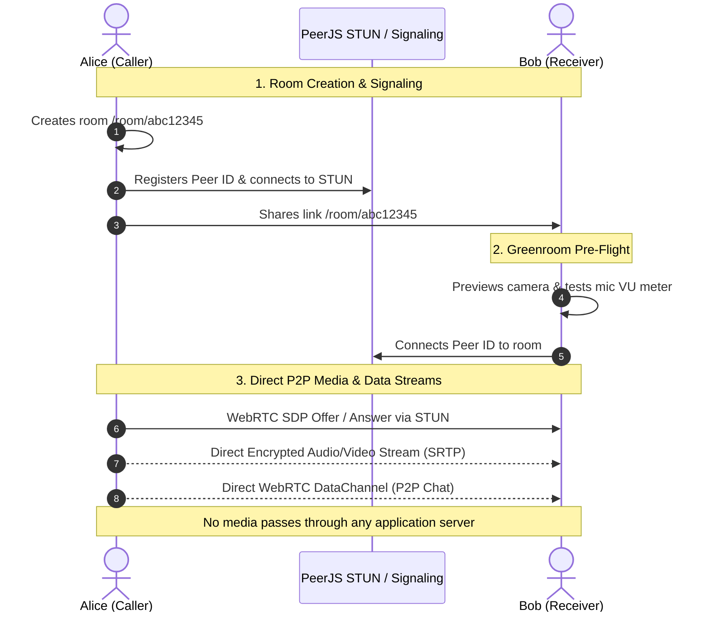

# 🌐 OpenLine

<div align="center">

**Instant, Private, Peer-to-Peer Video & Audio Calls — No Accounts, No Trackers, No Server Storage.**

[](https://nextjs.org/)
[](https://react.dev/)
[](https://peerjs.com/)
[](https://tailwindcss.com/)
[](https://www.typescriptlang.org/)
[](LICENSE)

<br />

[Features](#-key-features) • [Architecture](#-how-it-works) • [Quick Start](#-quick-start) • [UI/UX & Design](#-uiux-design-philosophy) • [Project Structure](#-project-structure) • [Configuration](#-configuration--presets)

</div>

---

## 📖 Overview

**OpenLine** is a modern, lightweight, privacy-first video and voice calling web application built on **Next.js 16**, **React 19**, and **WebRTC (PeerJS)**. 

Unlike traditional video conferencing software that requires accounts, downloads, or routes media through central servers, OpenLine establishes direct **Browser-to-Browser (P2P)** encrypted media and data streams. Create a room with a single click, share the short link, and start communicating immediately with zero friction.

---

## ✨ Key Features

| Feature | Description |
| :--- | :--- |
| 🔒 **100% Peer-to-Peer Privacy** | Direct browser-to-browser media stream via WebRTC. No central media relay recording or storing your conversations. |
| 🚀 **Zero Sign-Up / Instant Access** | Generate unique nanoid rooms or join existing rooms with one click. No logins or passwords required. |
| 🎥 **1080p Full HD Video** | Crystal clear video calling with dynamic quality presets (`1080p`, `720p`, `480p`, `360p`). |
| 🎙️ **Audio-Only Calling Mode** | Ultra-lightweight mode designed to save battery and conserve bandwidth on mobile or metered connections. |
| 🚦 **Greenroom Pre-Flight Check** | Preview your camera, test microphone levels with real-time Web Audio API VU meters, and select devices before joining. |
| 🖥️ **One-Click Screen Sharing** | Share full screens, application windows, or browser tabs smoothly with seamless media track negotiation. |
| 💬 **In-Call P2P Chat** | Real-time text messaging over WebRTC `DataChannel` with unread count badges, timestamps, and zero server persistence. |
| 📱 **Mobile & Touch Optimized** | Mobile-adapted UI with front/back camera flipping (`facingMode`), Picture-in-Picture (PiP), and native Web Share API integration. |
| ⚙️ **Live Device & Quality Switching** | In-call settings modal to change microphones, cameras, or video resolution on the fly without dropping the call. |
| 🎨 **Emil Kowalski-Inspired Polish** | Dark mode aesthetics with glassmorphism, spring active press states, smooth popover menus, and custom scrollbars. |

---

## 🏗️ How It Works



1. **Signaling**: PeerJS and Google STUN servers resolve NAT traversal and exchange ICE candidates.
2. **Media Exchange**: Direct peer-to-peer WebRTC media stream (`getUserMedia` / `getDisplayMedia`) is established directly between both clients.
3. **Data Channel**: A bidirectional `RTCDataChannel` handles text messages in real time with zero server latency.

---

## 🚀 Quick Start

### Prerequisites

- **Node.js** `18.18+` or `20+`
- **npm**, **pnpm**, **yarn**, or **bun**
- A modern browser with WebRTC support (Chrome, Firefox, Safari, Edge, Brave, etc.)

### 1. Clone & Install Dependencies

```bash
# Clone the repository
git clone https://github.com/ssidikov/OpenLine.git
cd OpenLine

# Install dependencies
npm install
```

### 2. Run the Development Server

```bash
npm run dev
```

Open [http://localhost:3000](http://localhost:3000) in your browser.

### 3. Testing on Mobile / Local Network (HTTPS)

Browsers restrict `navigator.mediaDevices.getUserMedia` to `localhost` or secure `HTTPS` contexts. To test cross-device calling over your local Wi-Fi:

```bash
npm run dev:https
```

This starts Next.js with `--experimental-https` using local SSL certificates located in `./certificates/`. Access `https://<YOUR_LOCAL_IP>:3000` from your mobile phone or another computer on the same network.

### 4. Build for Production

```bash
# Build the optimized production bundle
npm run build

# Start the production server
npm run start
```

---

## 🎨 UI/UX & Design Philosophy

Built following modern design intelligence principles and the [ui-ux-pro-max](https://github.com) specification:

* **Dark-First Modern Aesthetics**: Deep zinc palette (`bg-zinc-950`, `bg-zinc-900/95`) with emerald accenting (`#10b981` / `text-emerald-400`), providing high contrast and comfortable long-session viewing.
* **Micro-Interactions & Physics**: Custom `--ease-out: cubic-bezier(0.23, 1, 0.32, 1)` transitions, `.btn-press:active { transform: scale(0.96); }` tactile button feedback, and spring-like popovers.
* **Non-Blocking In-Call Dock**: Floating glassmorphic controls anchored cleanly at the viewport bottom with quick-access primary actions and a secondary popover menu for screen sharing, camera flipping, and PiP.
* **Zero-Layout-Shift Greenroom**: Clean device testing stage with real-time Web Audio API frequency analysis visualizers and responsive aspect ratios.
* **Accessibility**: Proper semantic HTML5 elements, visible keyboard focus rings, `aria-labels`, and high-contrast text ratios compliant with WCAG AA standards.

---

## 📁 Project Structure

```
OpenLine/
├── app/
│   ├── globals.css                # Tailwind CSS v4 theme, ease curves, keyframe animations
│   ├── layout.tsx                 # Root layout with Inter & Outfit typography
│   ├── page.tsx                   # Landing page: Create/Join room with mode selection
│   └── room/
│       └── [roomId]/
│           └── page.tsx           # Room route handler with dynamic mode params
├── components/
│   ├── VideoCall.tsx              # Main orchestrator for P2P connection, streams & layout
│   ├── GreenroomModal.tsx         # Pre-join camera preview, device select & audio VU meter
│   ├── CallControls.tsx           # Floating call actions dock, popover menu & hangup
│   ├── ChatDrawer.tsx             # Slide-over P2P DataChannel chat with unread badges
│   ├── SettingsModal.tsx          # Dynamic in-call resolution & device selector
│   └── CopyLinkButton.tsx         # Clipboard copy button with Web Share API fallback
├── lib/
│   ├── peer.ts                    # PeerJS factory, STUN configuration, and getUserMedia helper
│   └── types.ts                   # TypeScript interfaces (QualityPreset, ChatMessage, UserMediaConfig)
├── certificates/                  # Local SSL certificates for HTTPS mobile testing
├── public/                        # Static assets and icons
├── next.config.ts                 # Next.js configuration
├── package.json                   # Project dependencies and npm scripts
└── tsconfig.json                  # TypeScript configuration
```

---

## ⚙️ Configuration & Presets

### Video Quality Presets

Configured in [`lib/types.ts`](file:///Users/sardor/Projects/OpenLine/lib/types.ts):

| Preset | Resolution | Aspect Ratio | Target FPS | Best For |
| :--- | :--- | :--- | :--- | :--- |
| **`1080p`** | 1920 × 1080 | 16:9 | 30 fps | High-speed fiber / desktop presentation |
| **`720p`** *(Default)* | 1280 × 720 | 16:9 | 30 fps | Standard HD video calls |
| **`480p`** | 854 × 480 | 16:9 | 30 fps | Moderate connections / mobile data |
| **`360p`** | 640 × 360 | 16:9 | 24 fps | Low bandwidth / high latency networks |

### STUN / ICE Servers

Configured in [`lib/peer.ts`](file:///Users/sardor/Projects/OpenLine/lib/peer.ts) using Google's public STUN servers for NAT traversal:

```typescript
export const STUN_SERVERS = [
  { urls: 'stun:stun.l.google.com:19302' },
  { urls: 'stun:stun1.l.google.com:19302' },
  { urls: 'stun:stun2.l.google.com:19302' },
  { urls: 'stun:stun3.l.google.com:19302' },
  { urls: 'stun:stun4.l.google.com:19302' },
];
```

---

## 📱 Mobile Browser Support

| Browser / OS | Video | Audio | Screen Share | Camera Flip | PiP |
| :--- | :---: | :---: | :---: | :---: | :---: |
| **iOS Safari (14.5+)** | ✅ | ✅ | ⚠️ *(OS restricted)* | ✅ | ✅ |
| **Android Chrome** | ✅ | ✅ | ✅ | ✅ | ✅ |
| **Desktop Chrome / Edge / Brave** | ✅ | ✅ | ✅ | N/A | ✅ |
| **Desktop Firefox** | ✅ | ✅ | ✅ | N/A | ✅ |
| **Desktop Safari** | ✅ | ✅ | ✅ | N/A | ✅ |

---

## 🛠️ Tech Stack & Libraries

- **Framework**: [Next.js 16](https://nextjs.org/) (App Router, Turbopack)
- **UI Library**: [React 19](https://react.dev/)
- **Networking**: [PeerJS 1.5](https://peerjs.com/) (WebRTC wrapper)
- **Styling**: [Tailwind CSS v4](https://tailwindcss.com/)
- **Typography**: [Inter](https://fonts.google.com/specimen/Inter) & [Outfit](https://fonts.google.com/specimen/Outfit) via `next/font`
- **ID Generation**: [nanoid](https://github.com/ai/nanoid)
- **Audio Analysis**: Web Audio API (`AudioContext`, `AnalyserNode`)

---

## 📄 License

Distributed under the **MIT License**. See `LICENSE` for more information.
